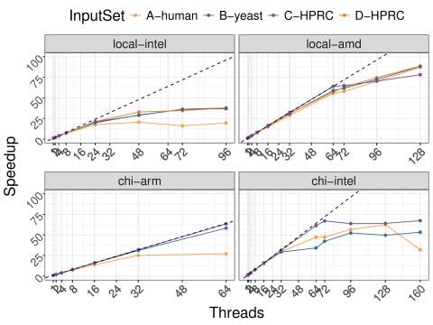

# miniGiraffe Artifact
This package contains scripts and data sets to reproduce the results from the paper "miniGiraffe: a Pangenome Mapping Proxy App" published on the proceedings of the 2025 IEEE International Symposium on Workload Characterization.

**Authors** - Jessica Imlau Dagostini, Scott Beamer, Tyler Sorensen, Joseph Manzano


[](http://dx.doi.org/10.5281/zenodo.16930195)

## Package content

- `data-from-paper/` - folder containing the original data used in the publication to generate the core results from the paper
- `experiments/` - scripts to reproduce the experiments
- `analysis` - scripts to reproduce the data analysis and plots

## General setup
Clone this repository/download this package to your local machine/server.

The following packages are needed to run the experiments
```
python3-pip
cmake
r-base
linux-tools-common # (or specific version for linux kernel)
libcurl4-openssl-dev libssl-dev libfontconfig1-dev  libxml2-dev libharfbuzz-dev libfribidi-dev libfreetype6-dev libpng-dev libtiff5-dev libjpeg-dev # (packages to install R-tidyverse)
```

After installing all required packages, run the following script to install python and R-script dependencies

```bash install-python-and-R-deps.sh```

Finally, clone the miniGiraffe's repository.

```git clone --recursive git@github.com:jessdagostini/miniGiraffe.git```

Those using Ubuntu/Debian OS can navigate to the artifact repository and run 
```bash config-env.sh```. This script will install all needed dependencies and clone miniGiraffe's repository.

Important to mention that, for those using Linux-based OS, to collect perf metrics, the user needs to run `sudo sysctl -w kernel.perf_event_paranoid=-1` to enable collection. This step is done at the `config-env.sh` script for those using Ubuntu/Debian.

### 🤖 Reproducing miniGiraffe's hardware validation
***Important** - these results are only reproducible on Intel/AMD machine that has support for perf counter and the following metrics: Instructions, Cycles, L1Cache Hit, L1Cache Miss, LL Cache Hit, LL Cache Miss.*

In this experiment, we collect hardware counters from the miniGiraffe's execution, highlighting the miniGiraffe's ease of use for collecting critical hardware metrics. In the paper, we also use these metrics alongside Giraffe's hardware counter metrics to validate the significance of our proxy compared to the parent application. Due to the significant complexity of building and modifying the complete VG Giraffe application to re-collect this data, we provide the original hardware metrics (at `data-from-paper/intelxeonplatinum8260cpu@240ghz/1` folder) and the specifications of the machine used for that initial collection. Users running miniGiraffe on a machine with similar characteristics can use this provided data to reproduce the validation experiment closely.

CPU characteristics:
```
Architecture:             x86_64
  CPU op-mode(s):         32-bit, 64-bit
  Address sizes:          46 bits physical, 48 bits virtual
  Byte Order:             Little Endian
CPU(s):                   96
  On-line CPU(s) list:    0-95
Vendor ID:                GenuineIntel
  Model name:             Intel(R) Xeon(R) Platinum 8260 CPU @ 2.40GHz
    CPU family:           6
    Model:                85
    Thread(s) per core:   2
    Core(s) per socket:   24
    Socket(s):            2
    Stepping:             7
    BogoMIPS:             4800.00
Caches (sum of all):      
  L1d:                    1.5 MiB (48 instances)
  L1i:                    1.5 MiB (48 instances)
  L2:                     48 MiB (48 instances)
  L3:                     71.5 MiB (2 instances)
NUMA:                     
  NUMA node(s):           2
  NUMA node0 CPU(s):      0-23,48-71
  NUMA node1 CPU(s):      24-47,72-95
```

To collect miniGiraffe's hardware metrics run

```python3 experiments/hw-counters-pipeline.py```

This will collect the 6 hardware metrics from miniGiraffe and store at `results/`.
To parse results and perform analysis, run
```Rscript analysis/table5-with-new-results.R```.


## 📈 Reproducing scalability analysis
In this experiment, we will reproduce the scalability analysis made with miniGiraffe. The original figure presents the scalability results from four different machines. Using the script `analysis/figure5-with-paper-results.R` users can generate the same image as below:



To reproduce the experiment, navigate to `experiments/` and execute the script `scalability-pipeline.py`.
This script will automatically download the 1000GP input set used in the paper's experiments and will run a set of different executions with different number of threads, accoriding to the machine's available threads.

It is also possible to run different input sets and collect their scalability performance. To do that, simply run

```python3 experiments/scalability-pipeline.py <path/to/sequence-seeds> <path/to/gbz> <input-set-name>```.

Given the size of the other input sets, they are not available for download in the direct miniGiraffe's format. To run with different input sets, see "Generating Input Sets".

To visualize/analyze the results, after finishing the execution, execute
```Rscript figure5-with-new-results.R```. It will output some results and generate an image with the scalability results. If this is run with multiple input sets, the plot will automatically include their results on the plot.

## 🚀 Reproducing auto tuning experiments
In this experiment, we explore the impact of different parameters in the performance of the mapping process. The goal is to find the best set of parameters for each input set and machine. The original figure presents this tuning for four different machines using four different input sets. Using the script `analysis/figure7-with-paper-results.R` users can generate the same image as below:


To reproduce the experiment, navigate to `experiments/` and execute the script `tuning-pipeline.py`.
This script will automatically download the 1000GP input set used in the paper's experiments and will run a set of different executions with different number of threads, accoriding to the machine's available threads.

It is also possible to run different input sets and collect their scalability performance. To do that, simply run

```python3 experiments/tuning-pipeline.py <path/to/sequence-seeds> <path/to/gbz> <input-set-name>```.

Given the size of the other input sets, they are not available for download in the direct miniGiraffe's format. To run with different input sets, see "Generating Input Sets".

To visualize/analyze the results, after finishing the execution, execute
```Rscript figure7-with-new-results.R```. This script will generate a plot with the best setting comparison and also a table identifying which were the values used in each parameter. If this is run with multiple input sets, the plot will automatically include their results on the plot.

## Input Sets
Four different datasets were used in this manuscript. There description is as follows:

|Input Set | Description |
|:-------- | ----------: |
| A-Human | Input set A-human uses the 1000GPlons pangenome created by the VG team using variants from the 1000 Genome Project. It maps a single-end read input from the NA19239 individual.|
| B-yeast| Input set B-yeast also explores the single-end workflow by using a yeast pangenome based on a full set of yeast samples, available on UCSC Genome Browser. | 
| C-HPRC| Input sets C-HPRC explore the paired-end workflow, using the latest version of the human pangenome graph built using variants from the Genome Reference Consortium Human Build 38. Sequence data comes from different fragments of the genome sequence of the NA24385 individual's son.|
| D-HPRC| Input sets C-HPRC explore the paired-end workflow, using the latest version of pangenome built from the complete human genome sequence CHM13. Sequence data comes from different fragments of the genome sequence of the NA24385 individual's son.|


Input set `A-Human` is available at [this zenodo](https://zenodo.org/records/14990368).

Given their size, it was difficult to find open solutions to host all input sets in miniGiraffe's format. The following instructions demonstrate how to generate new data to run with miniGiraffe.

### Generate New Input Sets
To create new datasets, users can use a modified version of VG Giraffe that will dump the necessary input data for miniGiraffe.
This Giraffe version is avaiable as a Docker Image [jessicadagostini/vg-dump:1.0](https://hub.docker.com/repository/docker/jessicadagostini/vg-dump/general).

Using the following command, the application will run the mapping and generate two files: `dump_miniGiraffe_seeds.bin` and `dump_miniGiraffe_extensions.bin`. The first contains the group of sequences + seeds needed to run the mapping process at miniGiraffe. The second is a file where user can validate if the output of miniGiraffe is coherent and valid with the parent's application.

To collect these files, users should run:

```
docker run -v ~/path/on/host:/path/on/container -w /path/on/container jessicadagostini/vg-dump:1.0 /vg/bin/vg giraffe -Z <.gbz> -m <.min> -d <.dist> -f <.fastq> -b default -t <threads> -p --track-correctness > test.gamcd
```

where `path/on/host` should refer to the host path where the files needed are available; `.gbz` refers to the GBWT format where the pangenome graph is stored; `.min` and `.dist` are VG indexes to aid in the mapping process; and the `.fastq` is the file format of the sequences to map.

### Input Set Source
To reproduce the experiments using the same datasets as presented in the paper, users should donwload the following resources

| Input Set | GBWTGraph/pangenome (.gbz) | Mininimizer (.min) | Distance Index (.dist) | Fasta files (.fastq)|
| :------- | :------: | -------: | ------: | -----: |
| B-yeast  | [Yeast Graph](https://cgl.gi.ucsc.edu/data/giraffe/mapping/graphs/generic/cactus/yeast_all/yeast_all.gbwt)  | [Yeast min](https://cgl.gi.ucsc.edu/data/giraffe/mapping/graphs/generic/cactus/yeast_all/yeast_all.min)  | [Yeast dist](https://cgl.gi.ucsc.edu/data/giraffe/mapping/graphs/generic/cactus/yeast_all/yeast_all.dist) | [SRR4074257.fastq](https://cgl.gi.ucsc.edu/data/giraffe/mapping/reads/real/yeast/SRR4074257.fastq.gz) |
| C-HPRC  | [Grch38 Graph](https://s3-us-west-2.amazonaws.com/human-pangenomics/pangenomes/freeze/freeze1/minigraph-cactus/hprc-v1.1-mc-grch38/hprc-v1.1-mc-grch38.gbz)  | [Grch38 min](https://s3-us-west-2.amazonaws.com/human-pangenomics/pangenomes/freeze/freeze1/minigraph-cactus/hprc-v1.1-mc-grch38/hprc-v1.1-mc-grch38.min)  | [Grch38 dist](https://s3-us-west-2.amazonaws.com/human-pangenomics/pangenomes/freeze/freeze1/minigraph-cactus/hprc-v1.1-mc-grch38/hprc-v1.1-mc-grch38.dist) | [D1_S1_L001_R1_004](https://s3-us-west-2.amazonaws.com/human-pangenomics/NHGRI_UCSC_panel/HG002/hpp_HG002_NA24385_son_v1/ILMN/NIST_Illumina_2x250bps/D1_S1_L001_R1_004.fastq.gz) <br /> [D1_S1_L001_R2_004](https://s3-us-west-2.amazonaws.com/human-pangenomics/NHGRI_UCSC_panel/HG002/hpp_HG002_NA24385_son_v1/ILMN/NIST_Illumina_2x250bps/D1_S1_L001_R2_004.fastq.gz) | 
| D-HPRC| [CHM13 Graph](https://s3-us-west-2.amazonaws.com/human-pangenomics/pangenomes/freeze/freeze1/minigraph-cactus/hprc-v1.1-mc-chm13/hprc-v1.1-mc-chm13.gbz) | [CHM13 min](https://s3-us-west-2.amazonaws.com/human-pangenomics/pangenomes/freeze/freeze1/minigraph-cactus/hprc-v1.1-mc-chm13/hprc-v1.1-mc-chm13.d9.min) | [CHM13 dist](https://s3-us-west-2.amazonaws.com/human-pangenomics/pangenomes/freeze/freeze1/minigraph-cactus/hprc-v1.1-mc-chm13/hprc-v1.1-mc-chm13.d9.dist) | [D1_S1_L002_R1_001](https://s3-us-west-2.amazonaws.com/human-pangenomics/NHGRI_UCSC_panel/HG002/hpp_HG002_NA24385_son_v1/ILMN/NIST_Illumina_2x250bps/D1_S1_L002_R1_001.fastq.gz) <br/> [D1_S1_L002_R2_001](https://s3-us-west-2.amazonaws.com/human-pangenomics/NHGRI_UCSC_panel/HG002/hpp_HG002_NA24385_son_v1/ILMN/NIST_Illumina_2x250bps/D1_S1_L002_R2_001.fastq.gz) |

***Important**: to generate new data, users need a machine with minimal 48GB RAM due to the sizes of the data. Also, these pipelines require a significant time to execute, directly depending on how many parallel threads will be used. For instance, D-HPRC can take approx. 40 minutes to complete using 48 threads. We DO NOT recommend running input sets C and D on your local machine.*